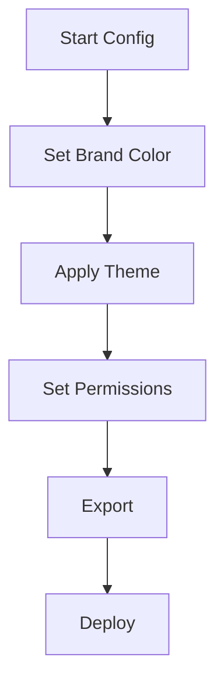

## Overview

Configure your Srishylam Jadi documentation space to match your brand and control access. You can apply custom colors, create themes, manage user permissions, and export content. Start with brand colors for quick branding, then explore advanced options.

<Columns cols={3}>
  <Card title="Brand Colors" icon="palette" href="#brand-colors">
    Apply your hex color like `#3B82F6` in seconds.
  </Card>
  <Card title="Custom Themes" icon="brush" href="#custom-themes">
    Design full themes with CSS variables.
  </Card>
  <Card title="Access Controls" icon="shield" href="#access-controls">
    Set roles for team members.
  </Card>
</Columns>

## Applying Brand Colors

Set your primary brand color to customize buttons, links, and highlights. Use the dashboard or config file.

<Steps>
  <Step title="Access Settings" icon="settings">
    Navigate to **Project Settings** > **Branding**.
  </Step>
  <Step title="Enter Color" icon="palette">
    Input your hex code, such as `#3B82F6`.
  </Step>
  <Step title="Preview and Save" icon="eye">
    Preview changes and click **Apply**.

    <Callout kind="tip">
      Changes apply site-wide and persist across updates.
    </Callout>
  </Step>
</Steps>

## Custom Themes

Create advanced themes by editing the theme configuration. Choose your method based on your setup.

<Tabs>
  <Tab title="Dashboard UI" icon="monitor">
    Use the visual editor:

    ```json
    {
      "primaryColor": "#3B82F6",
      "secondaryColor": "#1E40AF",
      "fontFamily": "Inter, sans-serif"
    }
    ```
  </Tab>
  <Tab title="Config File" icon="file">
    Edit `theme.json` in your project root:

    <CodeGroup tabs="JSON,YAML">
      ```json
      {
        "theme": {
          "colors": {
            "primary": "#3B82F6",
            "accent": "#60A5FA"
          }
        }
      }
      ```
      ```yaml
      theme:
        colors:
          primary: "#3B82F6"
          accent: "#60A5FA"
      ```
    </CodeGroup>
  </Tab>
</Tabs>

<Callout kind="info">
  Restart your dev server after file changes: `npm run dev`.
</Callout>

## Access Controls

Manage who can view, edit, or admin your docs. Assign roles via the **Team** tab.

| Role       | View | Edit | Admin | Description                          |
|------------|------|------|-------|--------------------------------------|
| Viewer     | ✅   | ❌   | ❌    | Read-only access to all pages.      |
| Editor     | ✅   | ✅   | ❌    | Edit content, no settings changes.  |
| Admin      | ✅   | ✅   | ✅    | Full control, including users.      |

<Expandable title="Advanced Permissions" default-open="false">
  Use environment variables for finer control:

  ```bash
  export EDITOR_IDS="user1@example.com,user2@domain.com"
  export VIEWER_GROUPS="team-viewers"
  ```
</Expandable>

## Export Options

Export your documentation for static hosting or backups.

<Columns cols={2}>
  <Card title="Static HTML" icon="download" horizontal>
    Generate a full static site.

    <CodeGroup tabs="CLI,UI">
      ```bash
      npx srishylam-jadi export --format=html --output=docs/
      ```
      ```bash
      # Via dashboard: Export > Static HTML
      ```
    </CodeGroup>
  </Card>
  <Card title="PDF Bundle" icon="file-text" horizontal>
    Create printable PDFs.

    ```bash
    npx srishylam-jadi export --format=pdf --all-pages
    ```
  </Card>
</Columns>



Your space now reflects your branding. Test exports in a staging environment before production.