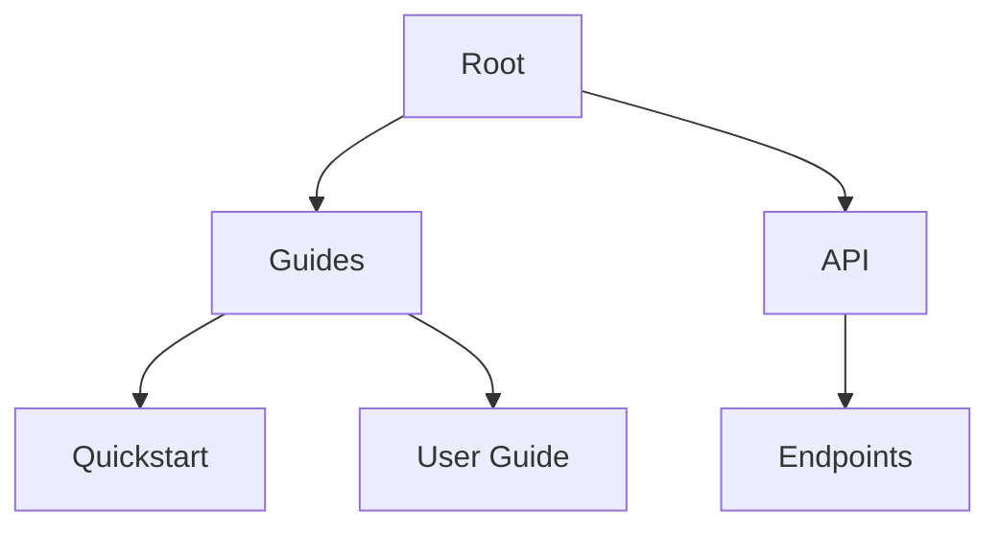

## Overview

Welcome to the Srishylam Jadi Documentation platform. You use this space to create, edit, and manage your project documentation efficiently. This guide covers editing and formatting, organizing content, collaboration, and version control basics. Follow these steps to get started quickly.

<Columns cols={3}>
  <Card title="Edit Docs" icon="edit-3" href="#editing">
    Learn to format content with Markdown and MDX components.
  </Card>
  <Card title="Organize Hierarchy" icon="folder" href="#hierarchy">
    Structure your docs into folders and pages.
  </Card>
  <Card title="Collaborate" icon="users" href="#collaboration">
    Work with your team seamlessly.
  </Card>
</Columns>

## Editing and Formatting Docs

You edit documents directly in the platform's editor. It supports Markdown and MDX for rich content.

<Steps>
  <Step title="Open a Doc" icon="file-text">
    Navigate to your project space and select a page to edit.
  </Step>
  <Step title="Format Content" icon="type">
    Use Markdown syntax for headings, lists, and code blocks. Add MDX components for interactive elements.
  </Step>
  <Step title="Preview Changes" icon="eye">
    Click Preview to see live rendering before saving.
  </Step>
</Steps>

<Tabs>
  <Tab title="Markdown Basics" icon="markdown">
    Start with standard Markdown:

    ```markdown
    ## Heading

    - List item
    - Another item

    `Inline code`
    ```

    Use this for simple pages.
  </Tab>
  <Tab title="MDX Components" icon="code">
    Enhance with components:

    ````jsx
    <Callout kind="info">
      This is a callout.
    </Callout>
    ````

    Components make docs interactive.
  </Tab>
</Tabs>

<Callout kind="tip">
  Always escape special characters like `{`, `}`, `<`, and `>` with backticks in prose, such as `{variable}` or `<100ms`.
</Callout>

## Organizing Content Hierarchy

You structure docs using folders and pages to create a clear navigation tree.

<Steps>
  <Step title="Create Folders" icon="folder-plus">
    In the sidebar, click New Folder and name it, e.g., "api" or "guides".
  </Step>
  <Step title="Add Pages" icon="plus">
    Right-click a folder and select New Page. Use YAML frontmatter for metadata:

    ```yaml
    ---
    title: API Reference
    description: Endpoint details
    ---
    ```
  </Step>
  <Step title="Reorder" icon="move">
    Drag pages or folders to adjust the hierarchy.
  </Step>
</Steps>



## Collaboration Features

Invite team members and collaborate in real-time.

<Tabs>
  <Tab title="Invite Users" icon="user-plus">
    Go to Settings > Members. Add emails and assign roles: Admin, Editor, Viewer.
  </Tab>
  <Tab title="Comments" icon="message-circle">
    Highlight text and add comments. Resolve them once addressed.
  </Tab>
</Tabs>

<Callout kind="alert">
  Changes are tracked automatically. Review history before merging.
</Callout>

## Version Control Basics

<Expandable title="Advanced Version Control" default-open="false">

You manage versions with built-in Git integration.

<CodeGroup tabs="CLI,UI">
  ```bash
  git pull origin main
  git add .
  git commit -m "Update user guide"
  git push origin main
  ```
  ```bash
  # Pull latest changes
  git checkout main
  git pull
  ```
</CodeGroup>

Use branches for features:

| Action       | Command                  |
|--------------|--------------------------|
| Create branch| `git checkout -b feature/docs` |
| Merge        | `git merge feature/docs` |

</Expandable>

This setup ensures your Srishylam Jadi docs stay organized and up-to-date. Explore more in your project space.